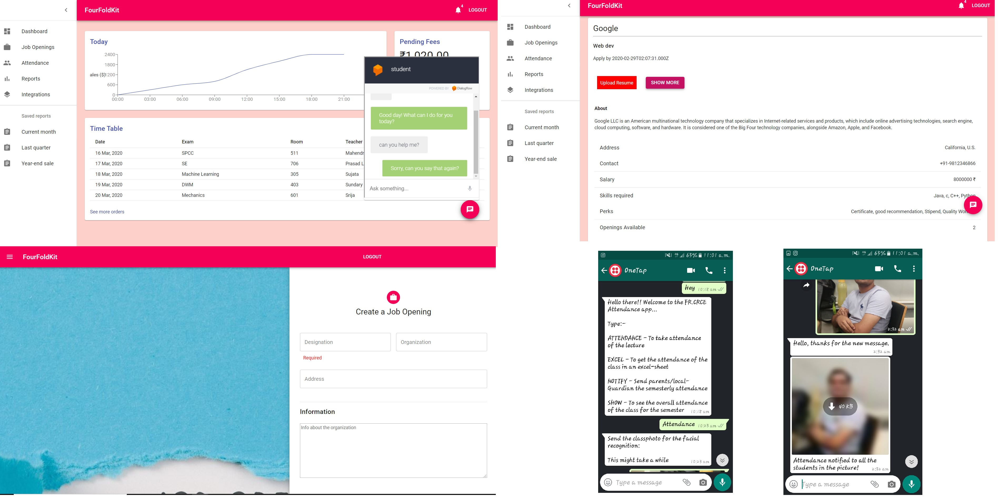

# FourFoldKit
Web Portal for recruiters to filter and interact directly with students

# Table of Contents

* [Description](https://github.com/amurto/fourfoldkit#description)
* [Dependencies](https://github.com/amurto/fourfoldkit#dependencies)
* [Installation](https://github.com/amurto/fourfoldkit#installation)
  * [Prerequisites](https://github.com/amurto/fourfoldkit#prerequisites)
  * [Instructions](https://github.com/amurto/fourfoldkit#instructions)
* [Usage](https://github.com/amurto/fourfoldkit#usage)
* [License](https://github.com/amurto/fourfoldkit#license)
 
# Description

- An Automated Attendance system using Face Recognition with WhatsApp interface.
- An efficient Placement cell for the students.
- More effective placement process for the companies that wish to recruit students from the college.
- A web portal for the teachers for student grading.

In addition to these primary features implemented, the teachers' performance is also evaluated using sentimental analysis from the feed back received from the students.

### Webapp Images


# Dependencies

* [npm](https://www.npmjs.com/)
* [Express.js](https://expressjs.com/)
* [MongoDB](https://www.mongodb.com/)
* [React.js](https://reactjs.org/)
* [Mapbox](https://www.mapbox.com/)

# Installation

### Prerequisites

Install Node.js and npm using the link above. Follow instructions on their respecive websites. Npm is included with Node.js. Setup MongoDB locally or on [MongoDB Atlas](https://www.mongodb.com/cloud/atlas) and get the connection string. This connection string has to be pasted [here](https://github.com/amurto/fourfoldkit/blob/master/backend/app.js). 

### Instructions

Clone the repository
```bash
git clone https://github.com/amurto/fourfoldkit.git
```

Install all the dependencies on backend
```bash
cd backend
npm install
```

Install all the dependencies on frontend
```bash
cd frontend
npm install
```

# Usage

Run the backend server
```bash
cd backend
npm start
```

Run the frontend
```bash
cd frontend
npm start
```

Open a web browser and go to
```bash
http://localhost:3000
```

# License

[](https://opensource.org/licenses/MIT)

[MIT License Link](https://github.com/amurto/fourfoldkit/blob/master/LICENSE)